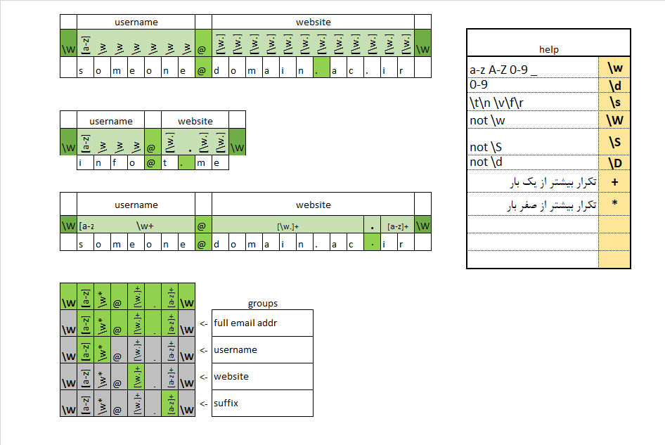

Regular Expressions
===================

## links : 

[pythex](https://pythex.org)

[reference](https://github.com/tartley/python-regex-cheatsheet/blob/master/cheatsheet.rst)

Non-special chars match themselves. Exceptions are special characters::

    \       Escape special char or start a sequence.
    .       Match any char except newline, see re.DOTALL
    ^       Match start of the string, see re.MULTILINE
    $       Match end of the string, see re.MULTILINE
    []      Enclose a set of matchable chars
    R|S     Match either regex R or regex S.
    ()      Create capture group, & indicate precedence

After '``[``', enclose a set, the only special chars are::

    ]   End the set, if not the 1st char
    -   A range, eg. a-c matches a, b or c
    ^   Negate the set only if it is the 1st char

Quantifiers (append '``?``' for non-greedy)::

    {m}     Exactly m repetitions
    {m,n}   From m (default 0) to n (default infinity)
    *       0 or more. Same as {,}
    +       1 or more. Same as {1,}
    ?       0 or 1. Same as {,1}

Special sequences::

    \A  Start of string
    \b  Match empty string at word (\w+) boundary
    \B  Match empty string not at word boundary
    \d  Digit
    \D  Non-digit
    \s  Whitespace [ \t\n\r\f\v], see LOCALE,UNICODE
    \S  Non-whitespace
    \w  Alphanumeric: [0-9a-zA-Z_], see LOCALE
    \W  Non-alphanumeric
    \Z  End of string
    \g<id>  Match prev named or numbered group,
            '<' & '>' are literal, e.g. \g<0>
            or \g<name> (not \g0 or \gname)

Special character escapes are much like those already escaped in Python string
literals. Hence regex '``\n``' is same as regex '``\\n``'::

    \a  ASCII Bell (BEL)
    \f  ASCII Formfeed
    \n  ASCII Linefeed
    \r  ASCII Carriage return
    \t  ASCII Tab
    \v  ASCII Vertical tab
    \\  A single backslash
    \xHH   Two digit hexadecimal character goes here
    \OOO   Three digit octal char (or just use an
           initial zero, e.g. \0, \09)
    \DD    Decimal number 1 to 99, match
           previous numbered group

Extensions. Do not cause grouping, except '``P<name>``'::

    (?iLmsux)     Match empty string, sets re.X flags
    (?:...)       Non-capturing version of regular parens
    (?P<name>...) Create a named capturing group.
    (?P=name)     Match whatever matched prev named group
    (?#...)       A comment; ignored.
    (?=...)       Lookahead assertion, match without consuming
    (?!...)       Negative lookahead assertion
    (?<=...)      Lookbehind assertion, match if preceded
    (?<!...)      Negative lookbehind assertion
    (?(id)y|n)    Match 'y' if group 'id' matched, else 'n'

Flags for re.compile(), etc. Combine with ``'|'``::

    re.I == re.IGNORECASE   Ignore case
    re.L == re.LOCALE       Make \w, \b, and \s locale dependent
    re.M == re.MULTILINE    Multiline
    re.S == re.DOTALL       Dot matches all (including newline)
    re.U == re.UNICODE      Make \w, \b, \d, and \s unicode dependent
    re.X == re.VERBOSE      Verbose (unescaped whitespace in pattern
                            is ignored, and '#' marks comment lines)

Module level functions::

    compile(pattern[, flags]) -> RegexObject
    match(pattern, string[, flags]) -> MatchObject
    search(pattern, string[, flags]) -> MatchObject
    findall(pattern, string[, flags]) -> list of strings
    finditer(pattern, string[, flags]) -> iter of MatchObjects
    split(pattern, string[, maxsplit, flags]) -> list of strings
    sub(pattern, repl, string[, count, flags]) -> string
    subn(pattern, repl, string[, count, flags]) -> (string, int)
    escape(string) -> string
    purge() # the re cache

RegexObjects (returned from ``compile()``)::

    .match(string[, pos, endpos]) -> MatchObject
    .search(string[, pos, endpos]) -> MatchObject
    .findall(string[, pos, endpos]) -> list of strings
    .finditer(string[, pos, endpos]) -> iter of MatchObjects
    .split(string[, maxsplit]) -> list of strings
    .sub(repl, string[, count]) -> string
    .subn(repl, string[, count]) -> (string, int)
    .flags      # int, Passed to compile()
    .groups     # int, Number of capturing groups
    .groupindex # {}, Maps group names to ints
    .pattern    # string, Passed to compile()

MatchObjects (returned from ``match()`` and ``search()``)::

    .expand(template) -> string, Backslash & group expansion
    .group([group1...]) -> string or tuple of strings, 1 per arg
    .groups([default]) -> tuple of all groups, non-matching=default
    .groupdict([default]) -> {}, Named groups, non-matching=default
    .start([group]) -> int, Start/end of substring match by group
    .end([group]) -> int, Group defaults to 0, the whole match
    .span([group]) -> tuple (match.start(group), match.end(group))
    .pos       int, Passed to search() or match()
    .endpos    int, "
    .lastindex int, Index of last matched capturing group
    .lastgroup string, Name of last matched capturing group
    .re        regex, As passed to search() or match()
    .string    string, "

Gleaned from the python 2.7 're' docs. http://docs.python.org/library/re.html

https://github.com/tartley/python-regex-cheatsheet
Version: v0.3.3

